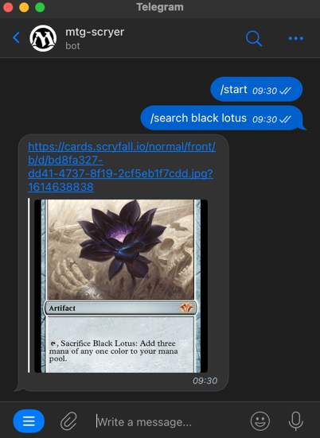

# aws-severless-mtg-fetcher
Fetch 'Magic The Gathering' cards using AWS serverless lambda & Telegram bot  

### Steps to setup:

Create a telegram bot:
- https://core.telegram.org/bots/tutorial
- add /search command to the bot via Botfather

Update 'fetch_mtg.py' with your telegram bot token 

Deploying with Terraform:
- navigate to the terraform directory
- update the 'provider.tf' file with your AWS credentials
- run: terraform init
- run: terraform plan
- run: terraform apply

Setup the telegram bot webhook:  
You need to setup a webhook for your telegram bot & lambda, which is easily done like so:  
- https://api.telegram.org/bot{your_bot_token}/setWebhook?url={url_to_send_updates_to}  

- your_bot_token is the token you got from BotFather when you created your Bot
- url_to_send_updates_to is the execution url of your lambda function, which you can get from the terraform output

Using the bot:
- Open Telegram and start a conversation with your bot
- Type: /search black lotus
- Bot should return the black lotus MTG card
- Test with any MTG card you like
- Easily add more commands via Botfather & updating the 'fetch_mtg.py' file
- Enjoy!